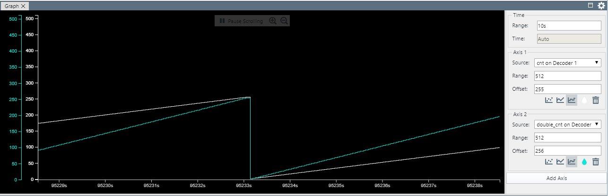

# PIC18F47Q10 EUSART Send Formatted Messages Using `printf`

It is a common use case for an application to send a message with variable fields over EUSART, when the
application reports a sensor reading, for instance. Using formatted messages is a very flexible approach and reduces the number of code lines. This can be accomplished by redirecting STDIO to EUSART.

In this example, a counter value and twice its value are sent in a binary format, using the Data Stream Protocol, over EUSART. The MPLABX Data Visualizer has a built-in Data Stream Protocol decoder and can display charts of the
values in the message in real time.

## Related Documentation

- [TB3282 - Getting Started with UART using EUSART on PIC18](https://www.microchip.com/wwwappnotes/appnotes.aspx?appnote=en1003086)
- [PIC18F-Q10 Family Product Page](https://www.microchip.com/design-centers/8-bit/pic-mcus/device-selection/pic18f-q10-product-family)
- [PIC18F47Q10 Data Sheet](http://ww1.microchip.com/downloads/en/DeviceDoc/40002043D.pdf)
- [PIC18F47Q10 Code Examples on GitHub](https://github.com/microchip-pic-avr-examples?q=pic18f47q10-cnano&type=&language=)

## Software Used

- MPLAB® X IDE 5.30 or newer [(microchip.com/mplab/mplab-x-ide)](http://www.microchip.com/mplab/mplab-x-ide)
- MPLAB® XC8 2.10 or a newer compiler [(microchip.com/mplab/compilers)](http://www.microchip.com/mplab/compilers)
- MPLAB® Code Configurator (MCC) 3.95.0 or newer [(microchip.com/mplab/mplab-code-configurator)](https://www.microchip.com/mplab/mplab-code-configurator)
- MPLAB® Code Configurator (MCC) Device Libraries PIC10 / PIC12 / PIC16 / PIC18 MCUs [(microchip.com/mplab/mplab-code-configurator)](https://www.microchip.com/mplab/mplab-code-configurator)
- Microchip PIC18F-Q Series Device Support (1.4.109) or newer [(packs.download.microchip.com/)](https://packs.download.microchip.com/)

## Hardware Used

- PIC18F47Q10 Curiosity Nano [(DM182029)](https://www.microchip.com/Developmenttools/ProductDetails/DM182029)

## Setup

The PIC18F47Q10 Curiosity Nano Development Board [(DM182029)](https://www.microchip.com/Developmenttools/ProductDetails/DM182029) is used as the test platform. It has an onboard debugger that acts as an USART to USB convertor so no further hardware is needed.

The following configurations must be made for this project:

| Pin | Configuration  |
| :-: | :------------: |
| RD0 | Digital Output |

## Operation

Run the code and configure the Data Visualizer as described in the Technical Brief document.

## Summary

This example shows how to enhance the "Hello World" use case with the ability to use printf function to send
messages over EUSART. In this example, messages are Data Stream protocol frames, MPLAB Data Visualizer
can be used to display them as plots.
